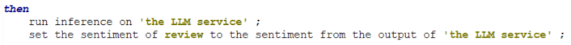

# watsonx.ai invocation from ODM

(more background in [this Medium post](https://medium.com/@pberlandier/using-generative-ai-in-a-rule-based-decision-32b67bb91403))

This repo provides a Java XOM library (see `watsonx-helper` [Maven project](./watsonx-helper)) to support the invocation of a watsonx.ai inference from ODM rules.

The `WatsonxAIRunner.java` class allows to:

- Store the different parameters for the LLM invocation (prompt template, prompt variables and model parameters). Most of the model parameters are associated with a default value.
-  Run a *[watsonx.ai](https://www.ibm.com/products/watsonx-ai)* inference using the above parameters, the watsonx.ai instance URL and the API key for this instance.

The class is verbalized in the `watsonx-model` BOM entry in the rule project, allowing to:

- Define the prompt template to be executed and the prompt variables. Below is an example of parameters setup:

   

- Execute the inference on the parameters:

   

## Simple use case

The simple use case for testing is about deciding how to dispose from a customer review, either publish it if the review is positive or ignore it if it's negative.

- The ODM input provides the customer review text. 
- A simple sentiment extraction prompt template return either `positive` or `negative` as a result.
- ODM passes the prompt template instantiated with the review text to the LLM.
- The LLM response is mapped to an enumeration and used in a decision table to decide how to dispose of the review.

### Sample execution

- Run `mvn install package` in the `watsonx-helper` folder to compile and package the the uber jar used for the ODM XOM. 
- Run the `reviewDisposition` decision operation to test the rules.
